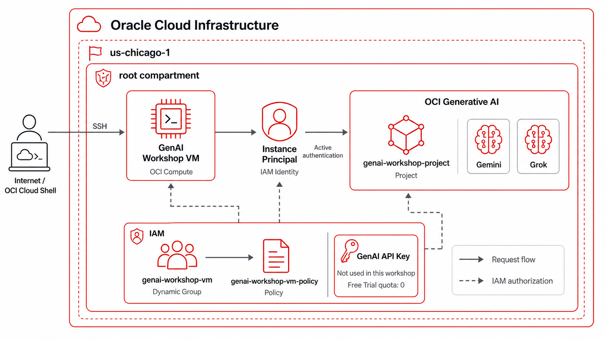
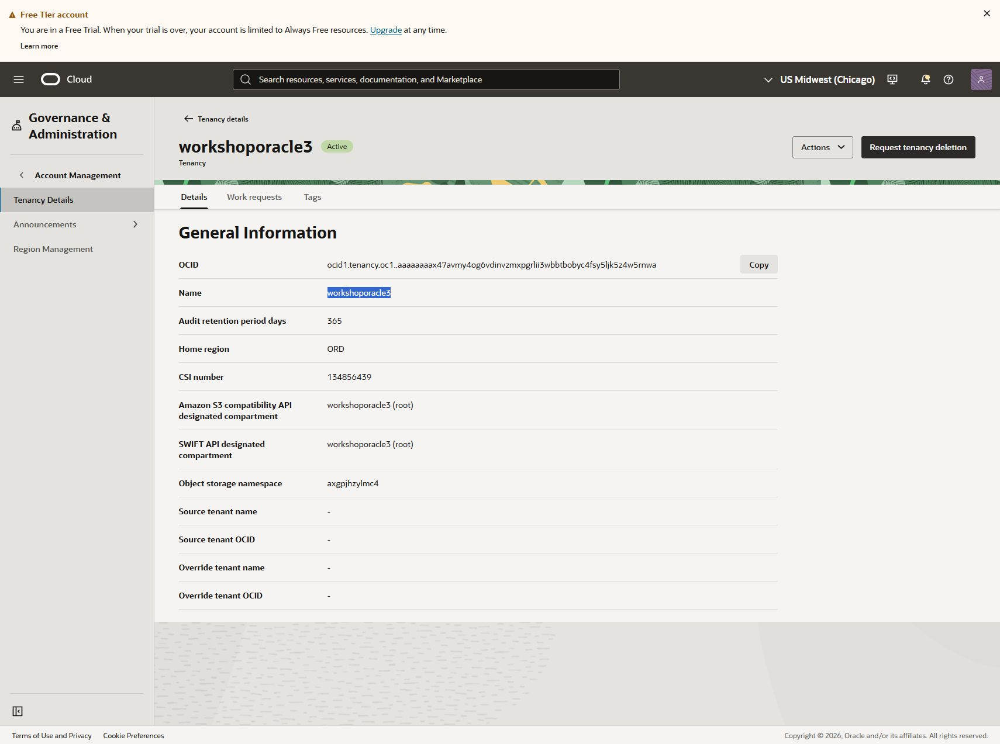
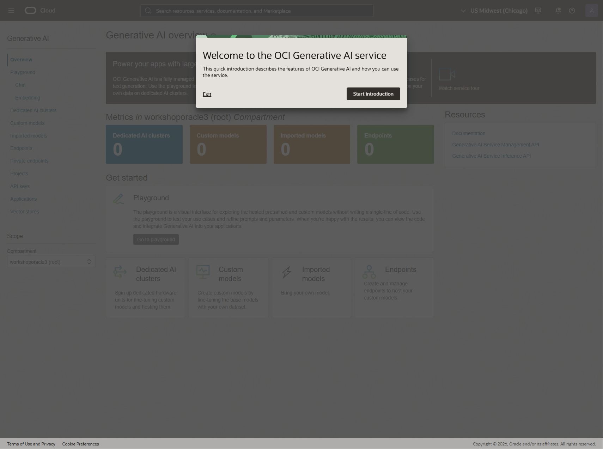
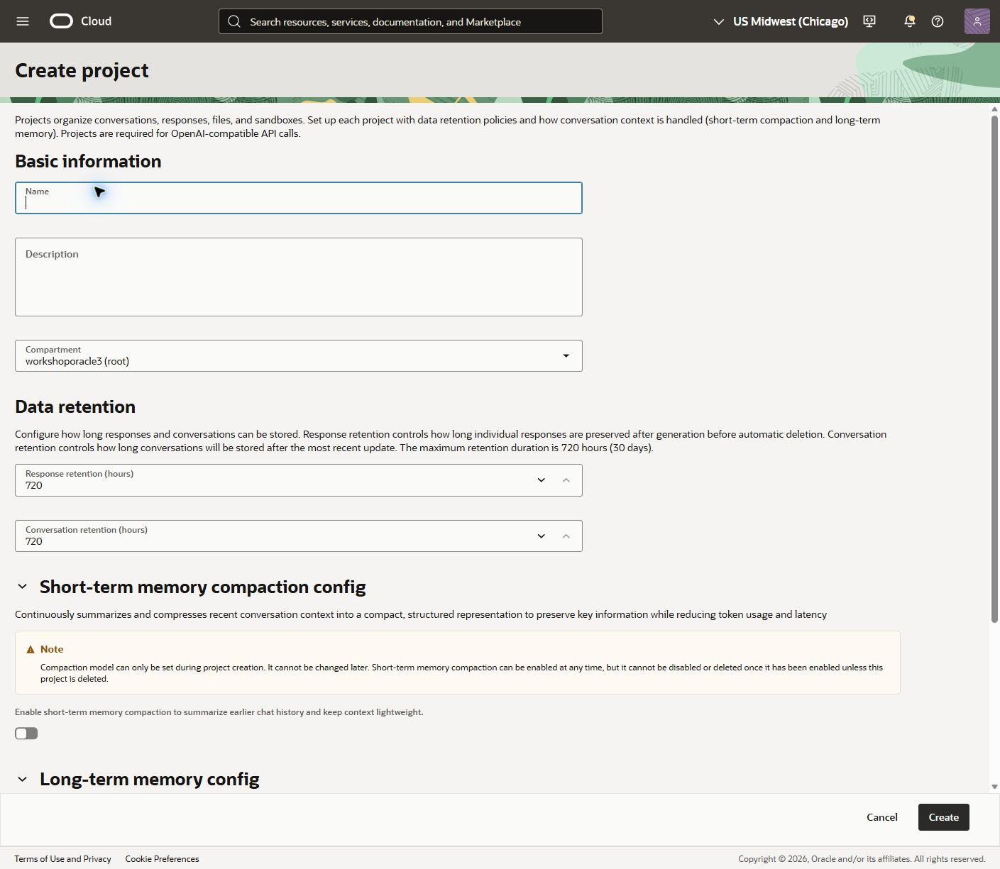
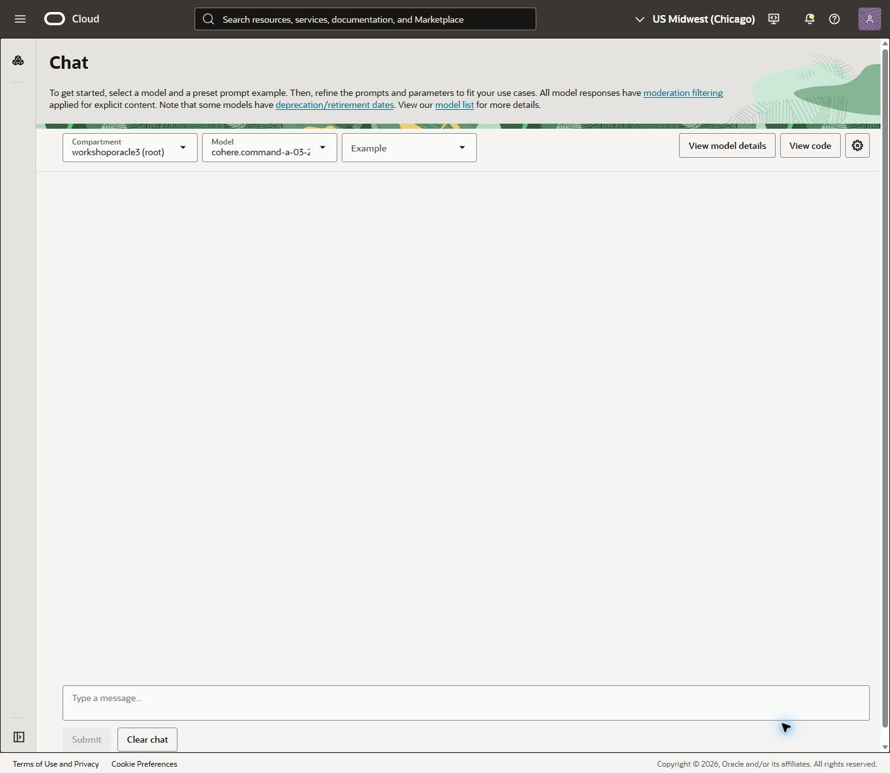
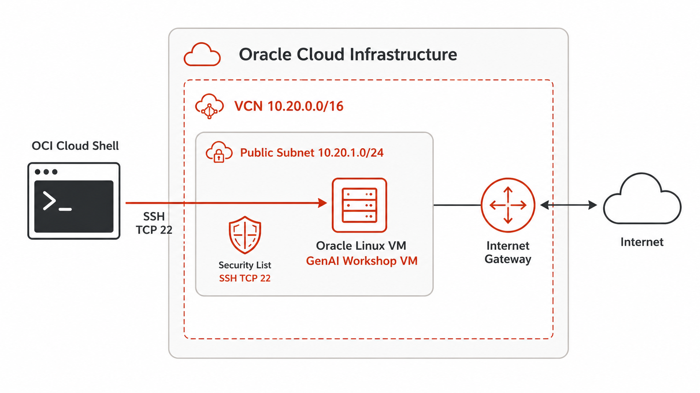
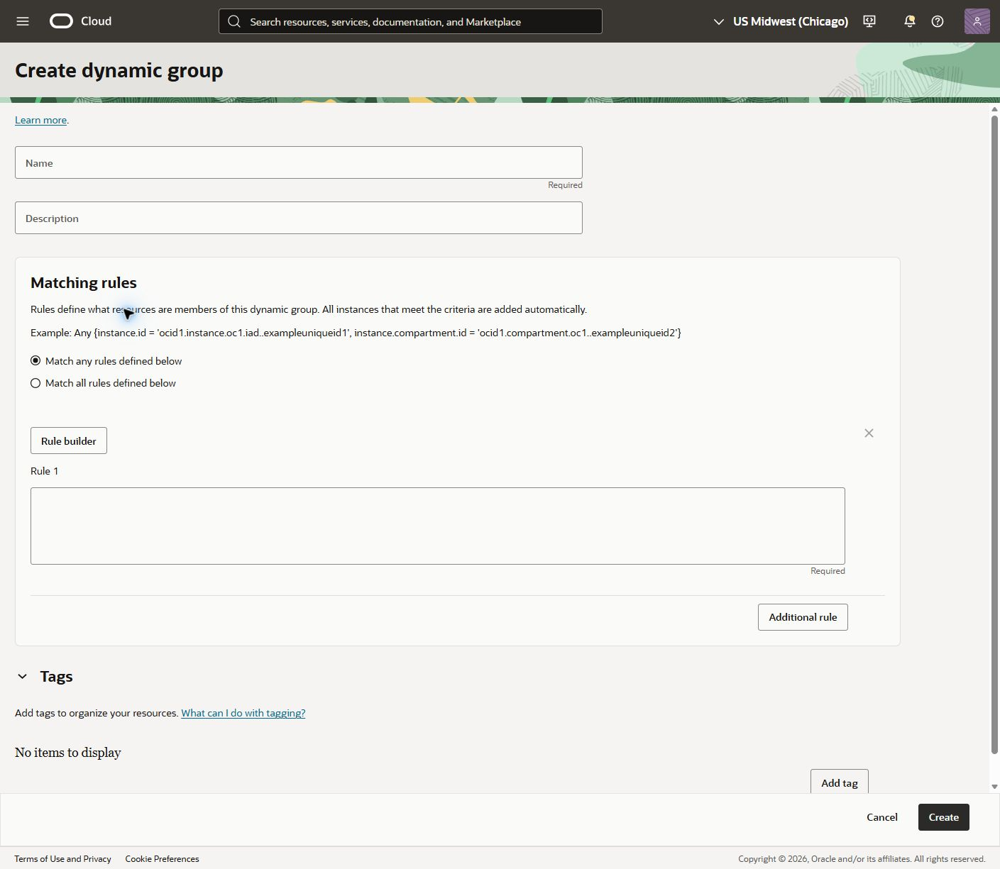
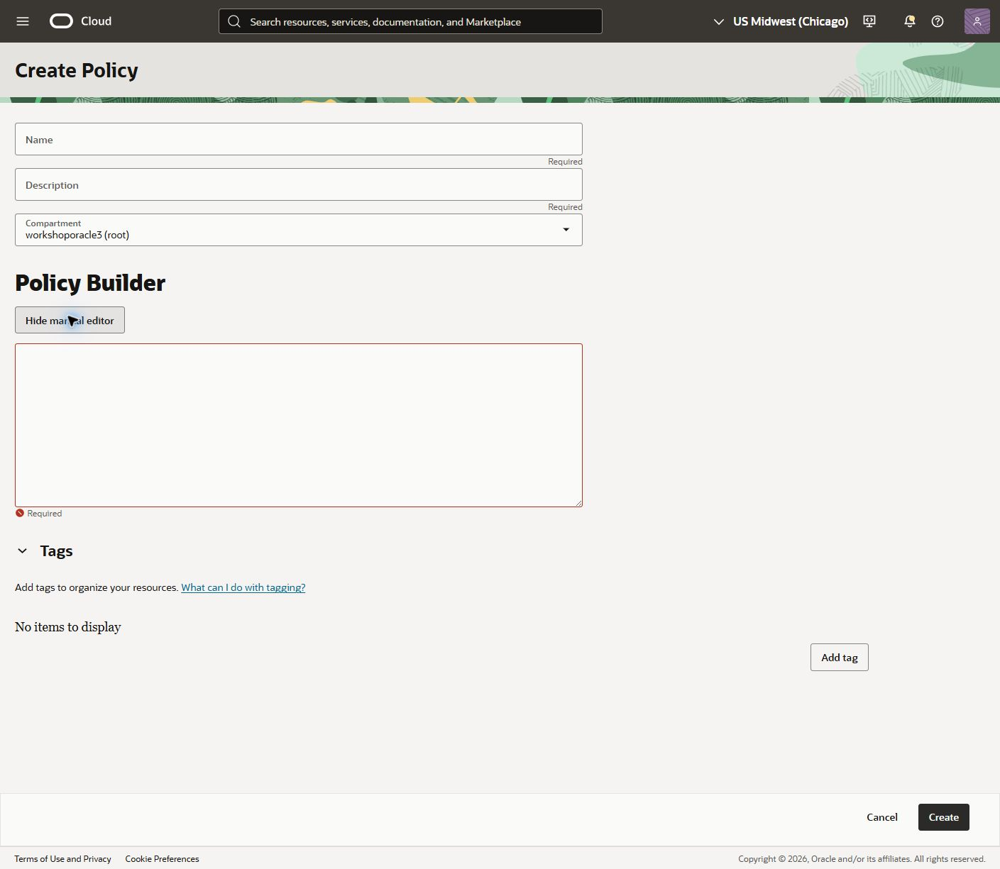

# Workshop: OCI Generative AI y procesamiento multimodal

Este workshop implementa una revisión de reserva de matrícula universitaria con OCI Generative AI. El flujo analiza un documento de identidad, certificado de notas y comprobante de abono para determinar si la solicitud cuenta con evidencia suficiente.

## Objetivos de aprendizaje

Al finalizar, cada participante podrá:

- Consumir directamente Gemini o Grok mediante OCI Generative AI.
- Cambiar de modelo mediante configuración, sin modificar el código.
- Procesar y contextualizar imágenes y PDF de una solicitud.
- Obtener respuestas JSON con un esquema validable.
- Contrastar un dato no sensible extraído del documento con una API pública.
- Usar una base de conocimiento vectorizada local y RAG para fundamentar una conclusión con políticas del negocio.



## Recorrido del workshop

| Etapa | Tema | Resultado |
|---|---|---|
| 1 | La primera conversación | Una pregunta abierta sobre el proceso universitario. |
| 2 | Un solo código, varios modelos | Selección por alias lógico, sin editar código. |
| 3 | Los documentos cuentan su historia | Análisis y contexto de los documentos entregados. |
| 4 | De documentos a decisiones estructuradas | Un JSON persistente de la revisión. |
| 5 | Contrastar antes de confiar | Corroboración no sensible del país emisor. |
| 6 | Decidir con conocimiento institucional | Decisión contrastada con políticas institucionales. |

```text
Documentos del estudiante → OCI Generative AI → JSON persistente
        → validación externa → ChromaDB / RAG → decisión trazable
```

## Configuración de OCI Generative AI

Completa esta sección en la consola de OCI antes de ejecutar los laboratorios. Trabaja en una región compatible con los modelos del workshop —para esta guía, **US Midwest (Chicago)** (`us-chicago-1`)— y usa el compartment raíz de tu propio tenancy. Todos los nombres siguientes son valores de ejemplo que los participantes pueden reutilizar.



> **Autenticación:** este workshop usa IAM, no API keys de OCI Generative AI. Cloud Shell firma las solicitudes con la sesión del participante y la VM usa un instance principal. No guardes secretos de OCI en el repositorio ni en archivos `.env`.

### 1. Abrir OCI Generative AI y seleccionar el compartment

**Descripción:** En la consola, abre **Analytics & AI → Generative AI**. Confirma la región y usa el selector de compartment de cada página para trabajar en `<tu-tenancy> (root)`.



### 2. Crear el proyecto

**Descripción:** El proyecto organiza conversaciones, respuestas, archivos y sandboxes. Es requerido por las llamadas compatibles con la API de OpenAI que se usarán durante el workshop.

1. Abre **Projects** y selecciona **Create project**.
2. En el selector superior de **Compartment**, selecciona `<tu-tenancy> (root)`.
3. Completa el formulario:

| Campo | Valor |
|---|---|
| **Name** | `genai-workshop-project` |
| **Description** | `Proyecto para laboratorios de modelos multimodales y RAG` |
| **Response retention (hours)** | `720` |
| **Conversation retention (hours)** | `720` |
| **Memory / compaction** | Deshabilitado |

4. Selecciona **Create**. Cuando el proyecto esté activo, abre su detalle y copia el **Project OCID**.



### 3. Validar modelos disponibles y preparar la configuración

**Descripción:** Abre **Playground → Chat**. En los selectores superiores usa el compartment `<tu-tenancy> (root)`, selecciona un modelo Gemini o Grok disponible y envía la prueba siguiente:

| Campo | Valor |
|---|---|
| **Compartment** | `<tu-tenancy> (root)` |
| **Model** | Un modelo Gemini o Grok disponible en `us-chicago-1` |
| **Type a message...** | `Resume en una oración qué es OCI Generative AI.` |

Durante el workshop se elegirá el modelo mediante configuración, no modificando el código.



Antes de continuar, crea `oci-genai-oci-only/.env` desde `.env.example` y registra los identificadores que utilizará la aplicación. Elige el modo de autenticación según dónde ejecutes los laboratorios:

```text
OCI_GENAI_REGION=us-chicago-1
OCI_GENAI_PROJECT_ID=<PROJECT_OCID>

# En OCI Cloud Shell
OCI_GENAI_AUTH_MODE=session
OCI_CONFIG_PROFILE=DEFAULT

# En la VM de OCI
OCI_GENAI_AUTH_MODE=instance_principal
```

## Preparación del entorno

Cada participante trabaja en su propio tenancy OCI y crea una VM Oracle Linux 9 con IP pública. La creación incluye una VCN, subnet pública, Internet Gateway, tabla de rutas y una security list que permite SSH por TCP/22 desde `0.0.0.0/0`.



> **Seguridad del workshop:** SSH abierto a Internet es solo para un laboratorio temporal. Destruye los recursos al terminar.

### 1. Abrir OCI Cloud Shell y crear la VM

**Descripción:** Cloud Shell ya incluye OCI CLI. El script genera una clave RSA compatible con FIPS, crea la red y despliega la VM.

```bash
git clone --branch upd-workshop --single-branch <URL_DEL_REPOSITORIO>
cd ai-workshop-genai/infrastructure
chmod +x create-vm.sh destroy-vm.sh
REGION=us-chicago-1 ./create-vm.sh
```

El script imprime la IP pública y el **Instance OCID**, y guarda los OCIDs de los recursos en `.create-vm-state.env` para facilitar la limpieza posterior. Conserva el Instance OCID para el siguiente paso.

### 2. Autorizar la VM con IAM

**Descripción:** La VM se autenticará mediante un *instance principal*. No requiere API key, archivo de clave privada ni secreto de OCI.

Primero crea el Dynamic Group. En tenancies con Identity Domains, la ruta es **Identity & Security → Domains → Default → Dynamic groups → Create dynamic group**. Completa:

| Campo | Valor |
|---|---|
| **Name** | `genai-workshop-vm` |
| **Description** | `VM del workshop autorizada para OCI Generative AI` |
| **Matching rules option** | `Match all rules defined below` |
| **Matching rules** | `ALL {instance.id = '<INSTANCE_OCID>'}` |

Reemplaza `<INSTANCE_OCID>` por el valor impreso por `create-vm.sh`; conserva las comillas simples de la regla. Luego selecciona **Create**.



Después crea la política. **Ruta de consola:** **Identity & Security → Policies → Create Policy → Show manual editor**. Completa:

| Campo | Valor |
|---|---|
| **Name** | `genai-workshop-vm-policy` |
| **Description** | `Permite a la VM usar OCI Generative AI durante el workshop` |
| **Compartment** | `<tu-tenancy> (root)` |
| **Policy statements** | La sentencia mostrada debajo |

```text
allow dynamic-group genai-workshop-vm to manage generative-ai-family in tenancy
```

Selecciona **Create**. La política aplica al tenancy completo; úsala únicamente cuando cada participante trabaje en su propio tenancy. Si destruyes y recreas la VM, actualiza la regla del Dynamic Group con el nuevo OCID de la instancia.



> **Cloud Shell:** si el participante administra su propio tenancy, su sesión normalmente ya dispone de permisos para administrar recursos. Si usa un usuario sin privilegios, un administrador debe agregarlo a un grupo y crear una política equivalente para ese grupo en el tenancy.

### 3. Conectarse a la VM

**Descripción:** Oracle Linux utiliza el usuario `opc`.

```bash
ssh -o StrictHostKeyChecking=accept-new \
  -i ~/.ssh/workshop_oci \
  opc@<IP_PUBLICA_VM>
```

Valida la imagen y el nombre de la VM:

```bash
cat /etc/os-release
hostname
```

### 4. [Opcional] Destruir y recrear el entorno

**Descripción:** Ejecuta esta prueba antes del workshop para confirmar que no quedan recursos residuales entre participantes.

```bash
./destroy-vm.sh
```

Confirma escribiendo `DELETE`. El script termina la VM y elimina subnet, security list, tabla de rutas, Internet Gateway y VCN. Después puedes volver a crear el entorno:

```bash
REGION=us-chicago-1 ./create-vm.sh
```

Si la VM se creó con una versión anterior de `create-vm.sh` y no existe `.create-vm-state.env`, usa su OCID:

```bash
REGION=us-chicago-1 ./destroy-vm.sh --instance-id <OCID_DE_LA_VM>
```

## Instalación de software en la VM

Los laboratorios se ejecutan dentro de un entorno virtual de Python 3.12. Además de las dependencias de OCI Generative AI, se instala **ChromaDB** para la base vectorizada local y `sentence-transformers` para generar embeddings en la VM. No se crea ni se requiere un OCI Vector Store.

> **Tiempo estimado:** de 5 a 10 minutos. La primera ejecución de la etapa RAG descargará el modelo de embeddings seleccionado; requiere salida a Internet desde la VM.

### 1. Instalar paquetes base

**Descripción:** Conéctate como `opc` y ejecuta los siguientes comandos. Oracle Linux 9.8 admite el paquete `python3.12`; se invoca explícitamente porque `python3` continúa apuntando a Python 3.9.

```bash
sudo dnf install -y \
  git python3.12 python3.12-pip \
  curl wget unzip

python3.12 --version
git --version
```

### 2. Clonar el repositorio y crear el entorno virtual

**Descripción:** Sustituye `<URL_DEL_REPOSITORIO>` por la URL que recibió el participante. El entorno `.venv` aísla las bibliotecas del workshop del sistema operativo.

```bash
cd ~
git clone --branch upd-workshop --single-branch <URL_DEL_REPOSITORIO> ai-workshop-genai
cd ai-workshop-genai

python3.12 -m venv .venv
source .venv/bin/activate
python -m pip install --upgrade pip
```

Si el repositorio ya existe en la VM, entra en su directorio y ejecuta únicamente los últimos tres comandos.

### 3. Instalar las dependencias Python

**Descripción:** El archivo de requisitos contiene las librerías para OCI Generative AI, validación y RAG local. No uses `sudo pip`.

```bash
python -m pip install -r oci-genai-oci-only/requirements.txt
python -c "from oci_genai_auth import OciInstancePrincipalAuth; print('Autenticación IAM lista')"
```

El resultado esperado de la segunda instrucción es `Autenticación IAM lista`. Este paquete permite que la VM firme solicitudes con su *instance principal*.

### 4. Inicializar ChromaDB

**Descripción:** El proyecto incluye `pysqlite3-binary` para proporcionar la versión de SQLite que utiliza ChromaDB en Oracle Linux 9. Este comando crea la carpeta persistente `.chroma` y valida la colección local.

```bash
cd ~/ai-workshop-genai/oci-genai-oci-only
PYTHONPATH=src python - <<'PY'
from local_vector_store import collection

print(f"ChromaDB listo: {collection().name}")
PY
```

El resultado esperado incluye `ChromaDB listo: university_policies`.

### 5. Activar el entorno en cada conexión

**Descripción:** Cada nueva sesión SSH inicia sin el entorno virtual activo. Antes de ejecutar cualquier etapa del workshop, vuelve a activarlo:

```bash
cd ~/ai-workshop-genai
source .venv/bin/activate
```

Para salir del entorno virtual al terminar:

```bash
deactivate
```

## Parte 1: OCI Generative AI directo

Trabaja desde la VM y activa el entorno virtual. Coloca los documentos de cada estudiante en una carpeta, por ejemplo:

```text
oci-genai-oci-only/data/submissions/solicitud-001/
├── documento_identidad.jpg
├── certificado_notas.pdf
└── comprobante_abono.png
```

> Usa documentos ficticios o anonimizados. No subas información personal real a un entorno de laboratorio.

Ejecuta los laboratorios desde `oci-genai-oci-only`:

```bash
cd ~/ai-workshop-genai/oci-genai-oci-only
export PYTHONPATH=src
```

### Configurar la aplicación

**Descripción:** Las etapas que invocan OCI Generative AI requieren el OCID del proyecto. Copia la plantilla y reemplaza únicamente `<project-ocid>` con el Project OCID creado en OCI.

```bash
cp .env.example .env
vi .env
```

Valores mínimos en la VM:

```text
OCI_GENAI_PROJECT_ID=<project-ocid>
OCI_GENAI_REGION=us-chicago-1
OCI_GENAI_AUTH_MODE=instance_principal
```

### Datos ficticios incluidos

**Descripción:** El repositorio incluye una solicitud ficticia y sin validez oficial. Permite validar el flujo completo sin usar datos personales reales.

```bash
ls -1 data/submissions/solicitud-001
```

El resultado esperado muestra:

```text
certificado_notas.pdf
comprobante_abono.png
documento_identidad.jpg
```

### 1. La primera conversación

```bash
python src/01_basic/01_hello_response.py --model gemini
```

**Validación:** debe imprimirse `MODEL: gemini` y una respuesta sobre el uso de modelos multimodales en una universidad.

### 2. Un solo código, varios modelos

El argumento `--model` acepta un alias definido en `.env` mediante `OCI_GENAI_MODELS_JSON` o un identificador completo de OCI. Esto permite cambiar de modelo sin modificar el código:

```bash
python src/02_model_switching/02_hello_response.py --model grok

# También se puede usar el identificador completo del modelo
python src/02_model_switching/02_hello_response.py --model openai.gpt-oss-20b
```

**Validación:** debe imprimirse `MODEL: grok` o `MODEL: openai.gpt-oss-20b`, según el valor enviado. El único cambio es el argumento del comando.

Modelos recomendados para explorar en esta etapa:

| Modelo | Identificador de ejemplo | Cuándo usarlo en el workshop |
|---|---|---|
| Google Gemini 2.5 Flash | `google.gemini-2.5-flash` | Punto de partida equilibrado para texto, imágenes y velocidad. |
| Google Gemini 2.5 Pro | `google.gemini-2.5-pro` | Análisis más profundo de documentos y razonamiento complejo. |
| Google Gemini 2.5 Flash-Lite | `google.gemini-2.5-flash-lite` | Pruebas de alto volumen con prioridad en velocidad y costo. |
| xAI Grok 4.3 | `xai.grok-4.3` | Comparar una alternativa de razonamiento dentro del mismo código. |
| OpenAI gpt-oss-20b / gpt-oss-120b | `openai.gpt-oss-20b` / `openai.gpt-oss-120b` | Explorar modelos OpenAI de pesos abiertos disponibles en OCI. |

La disponibilidad depende de la región, el tipo de endpoint y la configuración del tenancy. Consulta la lista oficial completa de [modelos de OCI Generative AI por región](https://docs.oracle.com/en-us/iaas/Content/generative-ai/model-endpoint-regions.htm) antes de actualizar `OCI_GENAI_MODELS_JSON`. Para el workshop en Chicago, verifica específicamente la columna **US Midwest (Chicago)**.

### 3. Los documentos cuentan su historia

```bash
python src/03_multimodal/03_analyze_documents.py solicitud-001 --model gemini
```

El código transforma imágenes y hasta tres páginas de cada PDF en entradas visuales para el modelo. El resultado explica qué detectó y qué no puede confirmar.

**Validación:** debe identificar los tres tipos documentales y señalar que los archivos son ficticios o de demostración.

### 4. De documentos a decisiones estructuradas

```bash
python src/04_structured_output/04_structured_documents.py solicitud-001 --model gemini
```

El resultado se guarda en `data/results/solicitud-001/document_review.json`. Este JSON puede ser consumido posteriormente por una base de datos o un proceso institucional sin volver a procesar los documentos originales.

```bash
cat data/results/solicitud-001/document_review.json
```

**Validación:** el JSON contiene `documents`, `missing_required_documents`, `decision` y `human_review_required`.

### 5. Contrastar antes de confiar

```bash
python src/05_external_validation/05_validate_country.py solicitud-001
```

La etapa consulta la [API pública de países de FIRST.org](https://api.first.org/v1/get-countries) usando el código ISO alpha-3 que el modelo haya extraído del documento de identidad. El resultado se guarda en `external_validation.json`; no valida la identidad, pagos ni historial académico del estudiante.

```bash
cat data/results/solicitud-001/external_validation.json
```

**Validación:** si el modelo extrajo `PER`, la respuesta debe indicar el resultado de la corroboración del país. Una falla de la API no invalida por sí sola la solicitud.

### 6. Decidir con conocimiento institucional

```bash
python src/06_rag/06_index_knowledge.py
python src/06_rag/07_search_knowledge.py "¿Qué documentos son obligatorios?"
python src/06_rag/08_reservation_with_rag.py solicitud-001 --model gemini
```

La primera instrucción fragmenta las políticas de `data/knowledge/`, genera embeddings locales y los persiste en `.chroma`. La última recupera los fragmentos más relevantes, los incorpora al contexto del LLM junto con los JSON anteriores y guarda la conclusión en `reservation_decision.json`.

```bash
cat data/results/solicitud-001/reservation_decision.json
```

**Validación:** el JSON final debe incluir `decision`, `rationale`, `blocking_issues` y `policy_sources`.

En una tenancy con cuota disponible, ChromaDB podría reemplazarse por OCI Vector Store y File Search. En este workshop se usa ChromaDB por la limitación de Free Trial; el principio RAG es el mismo: recuperar evidencia relevante antes de pedir la conclusión al modelo.
